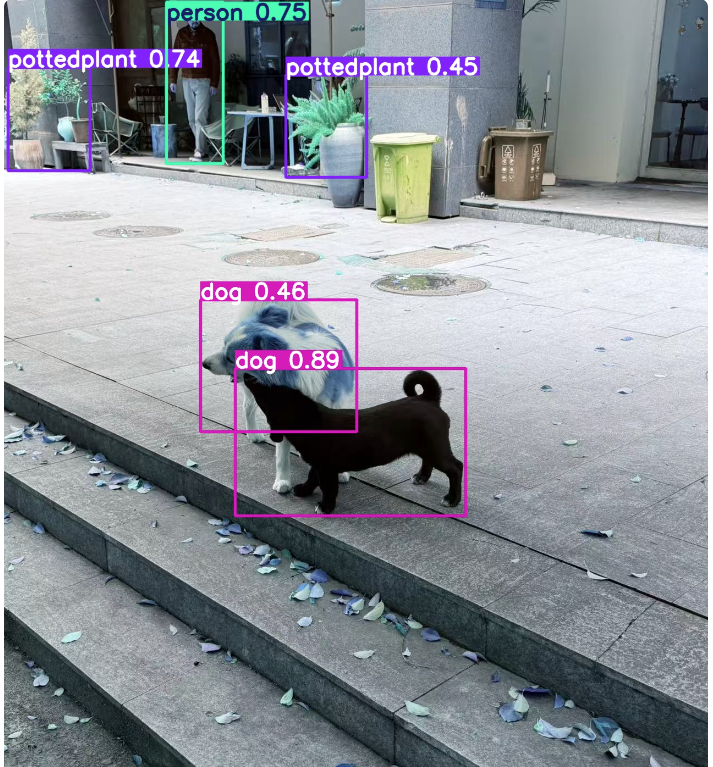

# YOLOv8 Object Detection on VOC2012

基于YOLOv8s在PASCAL VOC2012数据集上实现20类目标检测，并提供Streamlit交互式Demo。

## 实验结果

| Model | Epochs | mAP@0.5 | mAP@0.5:0.95 |
|-------|--------|---------|--------------|
| YOLOv8n | 50 | 72.4% | 53.0% |
| YOLOv8s | 100 | 74.2% | 55.6% |

## 技术栈

- Python 3.8
- PyTorch 1.9.1
- Ultralytics YOLOv8
- Streamlit
- PASCAL VOC2012（20类，5717张训练图）

## 项目结构

```
├── app.py              # Streamlit Demo
├── VOC2012.yaml        # 数据集配置
├── voc2yolo.py         # VOC XML转YOLO txt格式
└── README.md
```

## 快速开始

### 1. 安装依赖

```bash
pip install ultralytics streamlit
```

### 2. 数据准备

下载VOC2012数据集，运行格式转换：

```bash
python voc2yolo.py
```

### 3. 训练模型

```bash
python train.py
```

### 4. 启动Demo

```bash
streamlit run app.py
```

在侧边栏填入模型路径，上传图片即可检测。

## Demo效果



## 检测结果分析

各类别mAP@0.5（YOLOv8s，100epoch）：

| 类别 | mAP@0.5 | 类别 | mAP@0.5 |
|------|---------|------|---------|
| person | 0.850 | cat | 0.887 |
| dog | 0.848 | horse | 0.836 |
| bus | 0.840 | train | 0.848 |
| boat | 0.576 | bottle | 0.589 |
| pottedplant | 0.542 | - | - |

大目标（人、动物、车辆）检测效果好，小目标（船、花盆）相对较差，符合预期。
