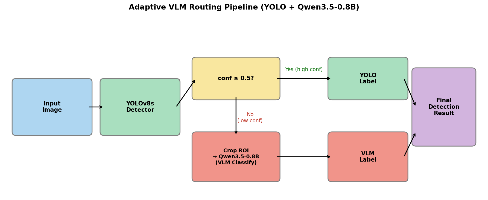
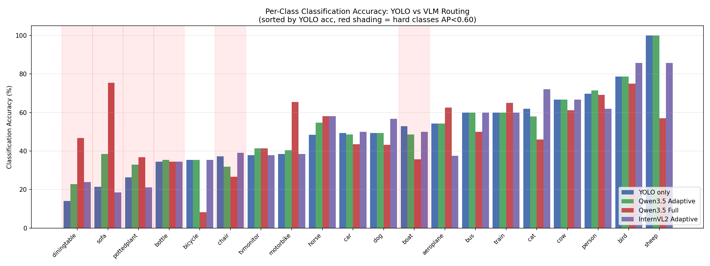

# yolov8-qwen3.5-adaptive-routing

<div align="center">


</div>

基于 YOLOv8s + Qwen3.5-0.8B 的自适应路由目标检测系统。对低置信度检测框引入轻量 VLM 进行语义消歧，在保持高吞吐的同时提升分类准确率，并提供 Streamlit 交互式 Demo。

## TL;DR

YOLOv8s 检测 → 低置信度框（conf < 0.5）触发 Qwen3.5-0.8B 语义消歧 → 高置信度框直接输出

| 指标 | YOLO Only | 本方案（Adaptive） |
| :--- | :---: | :---: |
| 图像级准确率 | 88.38% | **90.40%** |
| VLM 调用率 | — | **20.1%** |
| 框级别准确率（LoRA r4_qv） | 72.19% | **92.51%** |

---

## 项目背景与动机

YOLOv8s 在 VOC2012 上检测性能已经较强（mAP@0.5=73.23%，FPS=97.2），但其判别式分类头在视觉相似类别上存在固有盲区：

- **小目标**：bottle、pottedplant 的 AP@0.5 仅 0.53–0.57
- **语义相近类别**：sofa/chair、diningtable/person 混淆严重
- **低置信度框**：conf < 0.5 的框分类错误率显著高于高置信度框

单纯扩大模型规模收益有限，而全量 VLM 替换会带来显存和延迟的大幅上升。本项目提出**自适应路由策略**：只对低置信度框调用 VLM，高置信度框直接沿用 YOLO 结果，在效率和准确率之间取得最优平衡。

实验结果表明，自适应路由不仅节省了 80% 的 VLM 调用，准确率（90.40%）还高于全量 VLM（89.21%）。此外，通过对比 Qwen3.5-0.8B 与 InternVL2-1B，发现模型的指令遵循能力对受限分类任务的影响远大于参数量差异。

---

## 系统架构

本系统采用两阶段串联设计：YOLOv8s 负责定位，Qwen3.5-0.8B 负责对不确定框的语义消歧。置信度阈值（conf=0.5）作为路由开关，将检测框分流到不同的分类路径，在不牺牲高置信度框处理速度的前提下，对低置信度框引入更强的语义理解能力。



核心流程：

1. YOLOv8s 对全图做检测，输出边界框 + 置信度（检测阈值 conf ≥ 0.25）
2. 置信度 ≥ 0.5（路由阈值）：直接采用 YOLO 分类结果
3. 置信度 < 0.5：裁剪 ROI，送入 Qwen3.5-0.8B 做受限分类（从 VOC 20 类中选择）
4. 合并结果输出最终检测

> 两个阈值作用不同：conf ≥ 0.25 是 YOLO 的检测过滤阈值，决定哪些框被输出；conf = 0.5 是路由阈值，决定哪些框需要 VLM 二次判断。

---

## 评估方法说明

本项目采用两套互补的评估体系：

**图像级评估（系统级）**：若预测类别存在于该图像的 GT 类别集合中，则视为正确。覆盖全部 1334 个检测框，用于衡量整体系统性能。局限性：VOC2012 为图像级标注，多类别图像中存在假正确，导致准确率被高估。

**框级别精确评估（VLM 专项）**：针对低置信度框（conf < 0.5），人工逐框标注真实类别，构建精确评估集。共保存 262 个低置信度框 crop，标注过程中发现 28.6%（75/262）的框因遮挡、多目标混叠或检测框本身不准确而无法确定真实类别，标记为 ambiguous 并排除，最终有效样本 187 个。框级别评估消除了图像级匹配的高估问题，是验证 VLM 优化效果的可靠依据。

> 两套评估互补：图像级评估反映系统整体表现，框级别评估精确衡量 VLM 组件的真实能力。

---

## 实验结果

本节报告五组配置的量化对比结果，涵盖整体准确率、YOLO 检测指标、难类分析、per-class 可视化，以及 Qwen3.5 与 InternVL2 的消融实验。所有评估在相同数据集和检测框集合上进行，确保对比有效性。

### 整体性能对比

| 模型 | 分类准确率 | VLM 调用率 | 显存 | VLM 推理时间 | 端到端延迟/图 |
| :--- | :---: | :---: | :---: | :---: | :---: |
| YOLO only | 88.38% | — | — | — | **12 ms** |
| **Qwen3.5 Adaptive** | **90.40%** | **20.1%** | **1.62 GB** | 541 ms/crop | **302 ms** |
| Qwen3.5 Full | 89.21% | 100% | 1.62 GB | 541 ms/crop | 1,476 ms |
| InternVL2 Adaptive | 83.73% | 20.1% | 1.76 GB | 199 ms/crop | — |
| InternVL2 Full | 65.74% | 100% | 1.76 GB | 196 ms/crop | — |

> 评估基于 VOC2012 val 集前 500 张图像，共 1334 个检测框（conf ≥ 0.25）。端到端延迟 = YOLO 推理时间 + 该图平均 VLM 调用次数 × 单次 VLM 时间（RTX 3090 实测，avg_boxes_per_image=2.7）。YOLO only 吞吐量为 97.2 FPS（独立评估）；自适应模式下仅 20.1% 的框触发 VLM，端到端延迟仅为全量模式的 20%。

**关键结论：**
- 自适应路由（90.40%）优于全量 VLM（89.21%）：高置信度框由 YOLO 直接判断，避免了 VLM 在这部分框上因输出格式不一致（如 `airplane` vs `aeroplane`）引入的错误；路由策略本身有价值，而非简单的模型替换
- Qwen3.5 自适应仅调用 20.1% 的框，以极低代价换取整体准确率提升

### YOLO 检测指标

| 指标 | 数值 |
| :--- | :---: |
| mAP@0.5 | 73.23% |
| mAP@0.5:0.95 | 54.08% |
| FPS（RTX 3090） | 97.2 |

> 注：此处 mAP 由独立评估脚本 `eval_yolo.py` 在 VOC2012 val 集前 500 张图像上计算得出。训练过程中验证集最优 checkpoint 的 mAP@0.5 为 74.2%，两者差异来源于评估数据范围与协议不同（训练内置验证 vs. 独立脚本复现），均为真实结果。

### 难类分析（YOLO vs Qwen3.5 Adaptive）

难类定义：AP@0.5 < 0.65 的类别，视觉相似度高、小目标多。Delta 单位为百分点（pp）。

| 类别 | YOLO | Qwen3.5 Adaptive | Delta | AP@0.5 |
| :--- | :---: | :---: | :---: | :---: |
| pottedplant | 26.3% | 32.9% | +6.6 pp | 0.532 |
| bottle | 34.5% | 35.4% | +0.9 pp | 0.574 |
| boat | 52.9% | 48.6% | -4.3 pp | 0.569 |
| chair | 37.3% | 31.8% | -5.5 pp | 0.581 |
| diningtable | 14.1% | 22.8% | **+8.7 pp** | 0.588 |
| sofa | 21.5% | 38.5% | **+17.0 pp** | 0.637 |
| **平均** | **31.1%** | **35.0%** | **+3.9 pp** | — |

sofa、diningtable 提升显著，说明 VLM 的语义理解对形状相似类别有效。chair（-5.5 pp）和 boat（-4.3 pp）出现下降，这暴露了全局固定阈值的局限性：这两类视觉多样性高（chair 涵盖餐椅、办公椅、沙发椅，boat 涵盖帆船、快艇等），conf=0.5 的阈值对它们偏低，部分本应由 YOLO 直接判断的框被错误路由到 VLM，而 VLM zero-shot 在这类多样性高的低质量 crop 上同样难以判断。这验证了 per-class 自适应阈值的必要性，也是 Future Work 的首位。

### Per-Class 准确率对比



### 框级别精确评估：LoRA 微调效果验证

图像级评估存在系统性高估，为精确验证 LoRA 微调效果，对低置信度框（conf < 0.5）进行人工逐框标注，共保存 262 个 crop，排除 75 个 ambiguous 框，构建 187 个有效样本的精确评估集。

| 模型 | 框级别准确率 | vs YOLO |
| :--- | :---: | :---: |
| YOLO baseline | 72.19% | — |
| Qwen3.5-0.8B zero-shot | 78.61% | +6.42 pp |
| Qwen3.5-0.8B LoRA (r8_qv) | 90.37% | +18.18 pp |
| **Qwen3.5-0.8B LoRA (r4_qv)** | **92.51%** | **+20.32 pp** |

**关键发现：**
- 图像级评估下 LoRA 微调提升仅 +0.15 pp（90.40% → 90.55%），几乎不可见；框级别精确评估下最优配置（r4_qv）提升达 +13.90 pp（78.61% → 92.51%），说明图像级评估严重掩盖了 LoRA 的真实效果
- 标注过程中发现 28.6% 的低置信度框因遮挡、多目标混叠或检测框本身不准确而无法确定真实类别，说明低置信度区间的分类困难部分来自输入质量本身，而非模型能力不足

### LoRA rank 消融实验

为验证 rank 选择的合理性，在相同训练配置下对比了不同 rank 和 target_modules 组合，使用框级别精确评估集（187 样本）评估效果。

| 配置 | rank | target_modules | 可训练参数 | 占比 | 框级别准确率 |
| :--- | :---: | :--- | :---: | :---: | :---: |
| r4_qv | 4 | q_proj + v_proj | 159,744 | 0.019% | **92.51%** |
| r8_qv | 8 | q_proj + v_proj | 319,488 | 0.037% | 90.37% |
| r16_qv | 16 | q_proj + v_proj | 638,976 | 0.075% | 87.70% |
| r4_qvk | 4 | q_proj + v_proj + k_proj | 239,616 | 0.028% | 87.70% |
| r8_qvk | 8 | q_proj + v_proj + k_proj | 393,216 | 0.046% | 92.51% |
| r16_qvk | 16 | q_proj + v_proj + k_proj | 786,432 | 0.092% | 91.98% |

**关键发现：**
- 四组配置可训练参数均不超过基础模型的 0.10%，属于极轻量微调
- qv 组：rank 越小越好（r4 > r8 > r16），小数据集下小 rank 正则效果更重要
- qvk 组：rank 越大越好（r16 > r8 > r4），与 qv 组趋势相反——k_proj 扩大了参数空间，需要更大 rank 才能充分利用，小 rank 下反而引入噪声
- 最优配置 r4_qv 和 r8_qvk 准确率相同（92.51%），但 r4_qv 参数更少（0.019% vs 0.046%），是更高效的选择

### 路由阈值扫描（conf sweep）

对路由阈值 conf 在 0.30~0.95 范围内进行扫描，对比 base（zero-shot）和 LoRA 两个版本的图像级准确率与 VLM 调用率。

| threshold | Base 准确率 | LoRA 准确率 | VLM 调用率 |
| :---: | :---: | :---: | :---: |
| 0.30 | — | 88.61% | 4.2% |
| 0.40 | — | 89.43% | 12.1% |
| 0.50 | 90.40% | 90.48% | 20.1% |
| 0.60 | 91.08% | 91.38% | 27.7% |
| 0.70 | 91.38% | 92.20% | 36.3% |
| 0.75 | **91.75%** | — | 41.2% |
| 0.80 | 91.53% | **93.03%** | 48.6% |
| 0.90 | 90.85% | 93.10% | 75.0% |
| 0.95 | 90.33% | 93.18% | 95.7% |

**关键发现：**
- Base 版本呈倒 U 形曲线，峰值在 conf=0.75（91.75%），之后下降——VLM zero-shot 在高置信度框上反而引入错误，说明 conf=0.5 是 base 版本的合理选择
- LoRA 版本单调上升，这是图像级评估的 artifact：LoRA VLM 在高置信度框上也能提升图像级匹配得分
- conf=0.5 是效率-准确率的 Pareto 最优点：20.1% VLM 调用率，端到端延迟 302 ms/图；提高到 0.8 可达 93.03%，但延迟增加 2.4 倍，VLM 调用率 48.6%

### IoU Matching 评估

为分离检测误差和分类误差，引入基于 IoU 匹配的评估框架（`scripts/eval_iou_matching.py`）：用 class-agnostic IoU≥0.5 匹配预测框与 GT 框，在匹配成功的框上单独计算分类准确率。

| 模式 | det_precision | det_recall | matched_cls_acc | e2e_precision | e2e_recall |
| :--- | :---: | :---: | :---: | :---: | :---: |
| YOLO baseline | 76.25% | 76.14% | **94.60%** | 72.13% | 72.03% |
| Qwen3.5 Adaptive | 76.31% | 76.14% | 93.81% | 71.59% | 71.43% |
| Qwen3.5 Full | 76.31% | 76.14% | 82.71% | 63.12% | 62.98% |

**关键发现：**
- 三种模式的检测 precision/recall 基本一致（76.14% recall），检测框由 YOLO 统一输出，验证了评估框架的正确性
- IoU Matching 下 YOLO 的 matched_cls_acc（94.60%）高于 Adaptive（93.81%），但这恰恰验证了自适应路由的核心价值：VLM 的价值不在于替换已定位准确的框的分类，而在于处理 YOLO 定位不准的框——这些框在 IoU Matching 中直接被过滤掉了。在图像级评估（不要求 IoU 匹配）下，Adaptive 从 88.38% 提升到 90.40%，说明 VLM 确实在 YOLO 定位不准的框上发挥了作用
- Full 模式 matched_cls_acc 仅 82.71%：VLM 全量替换 YOLO 分类，在高置信度框上引入大量错误，进一步说明路由策略本身有价值

---

## VLM 选型

本项目的 VLM 选型以**轻量化、可本地部署**为核心标准，目标是在资源受限场景（单张消费级 GPU）下实现实时可用的检测-语义双层架构。选用 Qwen3.5-0.8B 作为主模型（early-fusion 架构，视觉 token 与文本 token 在同一 transformer 中联合建模，显存仅 1.62 GB），以 InternVL2-1B（late-fusion 架构：InternViT 视觉编码器 + LLM 拼接，显存 1.76 GB）作为参数量相近的消融对比模型，两者均可在单张 RTX 3090 上与 YOLOv8s 同时运行。

两个模型参数量相近（0.8B vs 1B），显存占用接近（1.62 GB vs 1.76 GB），但在受限分类任务上表现差异显著——这正是本项目消融实验的核心发现之一。

**指令遵循能力**

两个模型使用完全相同的 prompt 进行受限分类：

```
Choose the most likely category from: aeroplane, bicycle, bird, boat, bottle, bus,
car, cat, chair, cow, diningtable, dog, horse, motorbike, person, pottedplant,
sheep, sofa, train, tvmonitor. Answer with only the category name.
```

受限分类要求模型严格从 VOC 20 类中选择输出：

| 模型 | 非 VOC 输出数 | 非 VOC 输出率 | 示例 |
| :--- | :---: | :---: | :--- |
| Qwen3.5-0.8B | 0 / 1334 | **0.0%** | — |
| InternVL2-1B (Full) | 53 / 1334 | **4.0%** | airplane, motorcycle, baby, girl |
| InternVL2-1B (Adaptive) | 15 / 1334 | 1.1% | airplane, baby |

InternVL2-1B 倾向于输出自然语言描述（`airplane` 而非 `aeroplane`，`baby` 而非 `person`），语义上正确但不符合约束，导致这部分框直接计为错误。这也是 InternVL2 全量模式（65.74%）远低于自适应模式（83.73%）的主要原因：全量模式下 100% 的框都经过 InternVL2，格式不一致问题影响全部结果；自适应路由将 VLM 调用限制在 20.1% 的低置信度框内，同样的格式问题只影响这部分框，整体损失大幅压缩。

**选型结论**：Qwen3.5-0.8B 在 zero-shot 受限分类（从固定类别列表中选择输出）任务中指令遵循更稳定、准确率更高，最终选用 Qwen3.5 作为 VLM 组件。

---

## Demo

为了直观展示系统能力，本项目基于 Streamlit 构建了交互式 Demo，支持**图片检测**与**视频多目标追踪**两种模式，并集成 VLM 语义描述功能，支持中英文界面切换。用户无需编写代码，上传图片或视频即可实时查看检测结果、置信度、VLM 描述输出。

### Streamlit 界面


### 图片检测模式

上传图片后，系统自动运行 YOLOv8s 检测，标注边界框、类别与置信度。开启 VLM 描述开关后，对每个检测框裁剪 ROI 并调用 Qwen3.5-0.8B 生成语义描述。


### VLM 语义描述能力

Demo 中 VLM 以**自由描述模式**运行，用于展示 VLM 的语义理解能力上限；评估实验中 VLM 以**受限分类模式**运行，严格从 VOC 20 类中选择输出。两者 prompt 不同，用途不同。

Demo 自由描述 prompt：

- 中文模式：`用一句中文简短描述这个目标`
- 英文模式：`Describe this object briefly in one sentence.`

VLM 能够识别遮挡关系、目标属性等判别式模型难以表达的细粒度信息。由于自由描述输出难以量化，此处仅做案例展示。

**案例：两只狗的遮挡场景**

| YOLO 检测结果 | Qwen3.5 语义描述 |
| :---: | :---: |
|  |  |

VLM 对局部裁剪区域生成一句话描述，能够识别遮挡关系和细粒度属性（颜色、姿态），有效补充了判别式模型的类别信息。

### 视频多目标追踪（ByteTrack）

ByteTrack 是一种高性能多目标追踪算法，其核心思路是**不丢弃低置信度检测框**，而是将其纳入轨迹关联过程——相比传统方法只关联高置信度框，ByteTrack 能有效减少目标丢失和 ID 切换，在遮挡、快速运动等复杂场景下表现更稳定。

本项目集成 ByteTrack 对视频逐帧检测，为每个目标分配唯一 ID 并跨帧持续追踪，适用于人群、车辆等多目标密集场景。

[原始视频](assets/original_video.mp4) | [追踪结果](assets/tracked_video.mp4)

---

## 训练过程

### 模型选型

首先对比了 YOLOv8n 与 YOLOv8s 两个规格，在相同数据集上分别训练，结果如下：

| 模型 | Epochs | mAP@0.5 | mAP@0.5:0.95 |
| :--- | :---: | :---: | :---: |
| YOLOv8n | 50 | 72.4% | 53.0% |
| YOLOv8s | 100 | **74.2%** | **55.6%** |

YOLOv8s 在精度上有明显优势，最终选用 YOLOv8s 作为检测骨干。

### 训练配置

YOLOv8s 在 VOC2012 训练集上训练 100 个 epoch，使用默认超参数配置。以下曲线记录了训练过程中的收敛情况，可用于判断模型是否过拟合以及最优 checkpoint 的选取。

### Loss & mAP 曲线


### PR 曲线


### 混淆矩阵


---

## 快速开始

以下步骤适用于在本地或 Linux 服务器上复现实验、运行评估或启动 Demo。VLM 推理需要 GPU，建议显存 ≥ 16GB（实验在 RTX 3090 上进行）。

### 环境要求

- Python 3.10
- PyTorch 2.4（CUDA 12.1）
- GPU：建议 16GB+ 显存（实验在 NVIDIA RTX 3090 上进行）

### 安装依赖

```bash
# 先单独安装 PyTorch（需指定 CUDA 版本）
pip install torch==2.4.0 --index-url https://download.pytorch.org/whl/cu121

# 再安装其余依赖
pip install ultralytics streamlit transformers==5.5.4 accelerate einops timm
```

### 数据准备

下载 [VOC2012 数据集](http://host.robots.ox.ac.uk/pascal/VOC/voc2012/)，解压后运行格式转换：

```bash
python scripts/voc2yolo.py
```

> `voc2yolo.py` 默认读取 `VOCdevkit/VOC2012/Annotations`，请将数据集放在项目根目录下或修改脚本中的路径。

### 训练

```bash
python scripts/train.py
```

> 训练权重 `best.pt` 需自行训练生成，或联系作者获取。

### 评估

```bash
# YOLO baseline
python scripts/eval_yolo.py --data_dir /path/to/VOCdevkit/VOC2012 --model_path best.pt --yaml_path VOC2012.yaml

# Qwen3.5 自适应路由
python scripts/eval_qwen_adaptive.py --data_dir /path/to/VOCdevkit/VOC2012 --model_path best.pt --vlm_path /path/to/Qwen3.5-0.8B

# 生成分析图表
python scripts/eval_analysis.py
```

### 启动 Demo

```bash
streamlit run scripts/app.py
```

---

## 项目结构

项目分为三个主要部分：核心检测与追踪（`scripts/app.py`、`scripts/train.py`）、系统评估（`scripts/eval_*.py`）、以及分析与可视化（`scripts/eval_analysis.py`、`scripts/draw_pipeline.py`）。评估脚本共享 `scripts/eval_utils.py` 中的工具函数，结果统一输出到 `eval_results/`。

```
├── scripts/                    # 所有脚本
│   ├── app.py                  # Streamlit Demo
│   ├── train.py                # 训练脚本
│   ├── voc2yolo.py             # VOC XML → YOLO txt 格式转换
│   ├── eval_utils.py           # 评估工具函数（共享）
│   ├── eval_yolo.py            # YOLO baseline 评估
│   ├── eval_qwen_adaptive.py   # Qwen3.5 自适应路由评估
│   ├── eval_qwen_full.py       # Qwen3.5 全量 VLM 评估
│   ├── eval_ivl_adaptive.py    # InternVL2 自适应路由评估
│   ├── eval_ivl_full.py        # InternVL2 全量 VLM 评估
│   ├── eval_box_level.py       # 框级别精确评估
│   ├── eval_iou_matching.py    # IoU matching 评估（分离检测/分类误差）
│   ├── sweep_threshold.py      # 路由阈值扫描
│   ├── plot_threshold_sweep.py # 阈值扫描结果可视化
│   ├── eval_analysis.py        # 生成 per-class 准确率图表
│   ├── finetune_qwen_lora.py   # LoRA 微调脚本
│   ├── ablation_lora.py        # LoRA rank/target 消融训练
│   ├── eval_ablation_box_level.py  # 消融 checkpoint 框级别评估
│   ├── prepare_finetune_data.py    # 构造 LoRA 训练数据
│   ├── save_low_conf_crops.py  # 保存低置信度框 crop
│   ├── draw_pipeline.py        # 生成流程图
│   ├── remap_ivl_results.py    # InternVL2 同义词映射后处理
│   └── annotate_crops.ipynb    # 人工标注工具
├── ablation_lora/              # LoRA 消融 checkpoint
├── low_conf_crops/             # 低置信度框 crop 与人工标注
├── assets/                     # Demo 截图与演示素材
├── eval_results/               # 评估结果 JSON 与图表
├── VOC2012.yaml                # 数据集配置
└── best.pt                     # YOLO 训练权重（需自行训练）
```

---

## 技术栈

| 组件 | 技术 |
| :--- | :--- |
| 检测模型 | YOLOv8s（anchor-free，PAN-FPN neck，解耦检测头） |
| VLM | Qwen3.5-0.8B（early-fusion 架构，视觉与文本 token 联合建模，bfloat16 推理） |
| 对比模型 | InternVL2-1B（InternViT 视觉编码器 + LLM late-fusion 拼接架构） |
| 追踪算法 | ByteTrack |
| 框架 | Python 3.10 / PyTorch 2.4 / Transformers 5.5.4 |
| Demo | Streamlit |
| 数据集 | PASCAL VOC2012（20 类，5717 训练 / 5823 验证） |

---

## Future Work

当前实现在以下方向仍有优化空间：

- **路由阈值的 per-class 自适应**：当前 conf=0.5 是全局固定阈值，对 chair、boat 等视觉多样性高的类别偏低，导致部分本应由 YOLO 直接判断的框被错误路由。针对不同类别设置独立阈值有望进一步提升准确率。
- **更丰富的路由判据**：当前仅依赖置信度触发路由。引入 Top-1/Top-2 概率差（margin）或分类熵作为补充判据，可以捕捉"YOLO 高置信度但实际分类模糊"的情况，覆盖当前策略的盲区。
- **更大规模 VLM 的知识蒸馏**：当前 LoRA 微调直接使用 YOLO 伪标签，可进一步探索以 7B 级 VLM 作为 teacher 生成高质量软标签，蒸馏到 0.8B 模型，在不增加推理成本的前提下提升分类能力。

---

## License

MIT License. See [LICENSE](LICENSE) for details.
